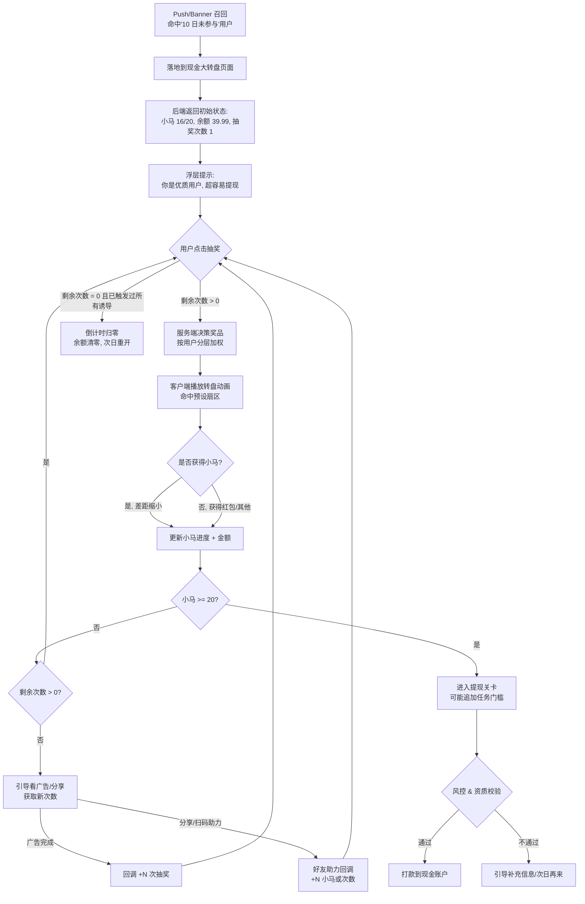

# 产品逆向分析报告

## Step 1: 核心功能与场景识别

- **产品定位**：以"集马兑现金"为叙事外衣、以"大转盘抽奖"为核心赌博式玩法的**春节现金激励型留存增长活动**——用户被"仅差 4 小马即可提现 40 元"的临门一脚叙事锁定，反复回到 App 消费时长、观看广告、邀请好友。
- **目标用户**：对小额现金（10–40 元档）敏感的下沉市场用户，典型画像为：
  - 价格敏感型中老年人与三线以下城市用户；
  - 时间充裕、愿意为 1–5 元付出 5–10 分钟操作成本；
  - 已经在平台有一定消费/浏览记录（被识别为"活动优质用户"，10 日内未参与过该活动的召回/唤醒对象）。
- **核心场景**：用户在 App 内（极大概率是拼多多/抖音极速版/快手极速版等下沉型 App）被 push 或 banner 引流至该落地页，看到"已获得 39.99 元，仅差 4 小马就能提现 40 元"的临界态，进入"再抽 1 次就能凑齐"的沉没成本循环，通过看广告、做任务、邀请好友等方式补齐收集度。界面解决的是平台方的痛点——**低成本、高 ROI 地延长用户停留时长、拉动 DAU/邀请分享**，而不是用户的痛点。

---

## Step 2: 模块拆解

### 2.1 模块概览表

| 模块名称 | 视觉位置 | 核心作用 | 优先级 (P0/P1/P2) |
| :--- | :--- | :--- | :--- |
| 顶部导航栏（返回/规则/明细/喇叭） | 顶部 | 品牌/合规入口，规则与明细用于满足监管留痕 | P1 |
| "今日有超多人成功提现"跑马灯 | 顶部标题下方胶囊 | 从众心理暗示，降低"这是骗局"的心理防线 | P1 |
| "春节活动特邀嘉宾"身份徽章 | 左上悬浮勋章 | 身份稀缺感制造，强化"你被选中"的特权心智 | P1 |
| 账户提现临界态卡片（"仅差 4 小马，40 元"） | 顶部主视觉区 | **核心钩子**——把用户锚定在"差一点就到手"的峰值预期 | P0 |
| 进度条（16/20 小马 + 加速红包入口） | 卡片下方带状区 | 可视化收集进度 + 引导点击"加速红包"（大概率对应看广告/任务） | P0 |
| "现金账户 40"余额角标 | 右上角黄底 | 让"已到账感"可视化，强化损失厌恶 | P1 |
| 大转盘（抽奖主控件 + 提现冲刺阶段标签 + 剩余次数） | 页面中部主视觉 | **核心操作入口**，驱动每一次抽奖行为 | P0 |
| "你是活动优质用户，超容易提现"浮层提示 | 转盘中部蒙层 | 触发前的认知预设，拉高中奖预期 | P0 |
| 底部 CTA"春节超容易提现 40 元" | 底部大号胶囊按钮 | 兜底转化入口（用户若划走转盘还能被拉回） | P0 |
| 扫码助力 | 底部右下角 | 社交裂变入口，把个人活动外溢到微信社交关系链 | P1 |
| 倒计时"23:55:59:5 后现金失效" | 页面最底部 | 稀缺性 + FOMO，制造"今天不做就归零"的紧迫感 | P0 |
| 水印（r36LhTVz 2026.02.22） | 转盘背后 | 防截图外传、反作弊追溯 | P2 |

### 2.2 深度模块分析

#### 模块 A｜账户提现临界态卡片（"仅差 4 小马，40 元"）

- **视觉层 (Visual)**：米黄底色规避"广告感"、让大字红色数字"40 元"与"4 小马"成为全局唯一视觉重心；卡片左侧的暗红色波浪勋章与右侧的小马 IP 吉祥物形成"官方感 + 萌系"的反差，降低戒备。40 元是整个页面字号最大的元素，远超"现金大转盘"标题——**说明团队在 AB 测中验证过"直接露出金额"优于"露出玩法名"**。
- **交互层 (Interaction)**：卡片整体大概率可点击，进入提现详情或直接跳转下一步任务；"39.99 元 / 16 / 4"三栏是状态展示，不可点击但会在每次抽奖后动画刷新（数字滚动）。加载态推测为骨架屏保持卡片高度，避免布局跳动破坏"即将到手"的心流。
- **信息架构 (IA)**：采用"身份 + 账户 + 进度 + 差距"的四段式叙事，信息权重由强到弱：**差距数字（4）> 金额（40 元）> 已获金额（39.99）> 用户 ID（173...）**。"39.99"这个小数点精度是关键——它让用户潜意识把"40 元"当作"马上就能兑的真实存量资金"，而不是"抽奖期望值"。

#### 模块 B｜大转盘（主操作控件）

- **视觉层 (Visual)**：8 等分扇形，但 5 个扇区已经变灰并带有"已去掉"印章，仅剩 3 个高亮扇区（高级春节红包 *3、高级春节红包、春节提现红包）。灰化处理制造"选择空间收窄 → 大奖可能性更高"的认知误导。中央红色指针式按钮 + 手指点击引导动效 + "还剩 1 次"的紧迫文案，构成典型的赌场式 slot machine 视觉语言。
- **交互层 (Interaction)**：点击"抽奖"后预期进入 3 阶段动画：加速旋转 → 匀速 → 减速命中；命中结果大概率被服务端预先决定（见下方业务逻辑推演），客户端只做展示。"还剩 1 次"说明抽奖次数是严格受控的资源，用完后会引导去看广告/分享获取新次数。Error 态（网络失败）推测回退为 toast 且不扣次数，避免投诉。
- **信息架构 (IA)**："提现冲刺阶段"的橙红胶囊标签将转盘阶段化，暗示"你现在处于最后冲刺"，让用户感到"随机抽奖"已经切换成"接近必胜"。扇区的奖品从"*3 倍数红包"到"春节提现红包"层次递减，**但"已去掉"的 5 个扇区无法验证其真假**——这是该类活动的核心灰色地带。

#### 模块 C｜"你是活动优质用户，超容易提现"浮层

- **视觉层 (Visual)**：黑色半透明浮层，"优质用户"与"超容易提现"加粗加色，下方用极小号灰字给出限定条件——"10 日内未参与过现金大转盘活动的用户"。这是典型的"放大卖点字号、缩小限制字号"合规写法，做到了"披露"但未做到"显著披露"。
- **交互层 (Interaction)**：浮层推测在首次进入时 2–3 秒后自动消失，或点击任意区域消失；不会阻塞用户点抽奖。
- **信息架构 (IA)**：语义层面把"10 日未参与"（一个平淡的召回条件）翻译成"优质用户"（一个身份稀缺感标签），是话术改写的典型案例。

#### 模块 D｜底部 CTA +倒计时 + 扫码助力

- **视觉层 (Visual)**：绿色底 + 黄色大按钮，全局最强对比色；倒计时精确到 0.1 秒，是制造 FOMO 的工程级选择（秒级倒计时会让用户产生"真的马上就归零"的急迫感）。
- **交互层 (Interaction)**：底部 CTA 与中央"抽奖"按钮功能大概率**同构**（都消耗 1 次抽奖机会），目的是让用户在页面任何区域都能一键触发核心行为。扫码助力则跳转微信小程序/H5，把活动病毒式外溢。
- **信息架构 (IA)**：倒计时放在最底部而非顶部，是精心设计的——顶部已经承担"金额显示"重任，如果顶部再放倒计时会让用户在"焦虑 + 贪婪"双重刺激下直接跳出。底部倒计时起到的是"滑动到底想离开时，再拉回来一次"的兜底作用。

### 2.3 业务逻辑推演

- **底层规则**：
  - **提现门槛**：20 个小马 = 40 元提现资格；用户已收集 16 个 = 39.99 元余额 → 每个小马不等值（第 20 个小马只值 0.01 元），**说明小马与金额非线性挂钩，越接近临界点单个增益越小，这是经典的"渐近线"奖励曲线**，让用户每一步都感觉"离终点只差一点"但实际要付出指数级代价。
  - **抽奖结果服务端决定**：转盘必然是"所想即所得"的服务端 pre-determined 结果；客户端只做动画对齐。否则无法规避活动成本失控。
  - **用户分层命中**：`is_quality_user = (last_participate_time < now - 10d)` 是准入标签，推测后端还维护了更多标签（历史提现金额、当前余额、活跃度、付费等级）决定每次抽奖的奖品权重。
  - **奖品池动态收窄**：转盘 5/8 扇区"已去掉"大概率不是真的抽掉了，而是随 session 展示的固定视觉资产，用来制造"选项收窄"的错觉；真实奖品池是服务端独立维护的配置。
  - **倒计时边界**：23:55:59 大概率是"当天 24 点截止"的显示包装，而非个人维度的 24 小时计时——用户次日若再进入，会被重新发一轮倒计时 + 新的"4 小马差距"。
  - **"再抽 2 次"加速红包**：右侧角标明显是广告激励入口（看一条广告给 2 次），这是平台的核心变现路径——**用户要的是 0.01 元，平台收的是 CPM**。

- **数据流向**：
  - **前端输入**：用户 userId、来源渠道、push 点击 token、抽奖点击事件、广告观看完成事件、分享结果回调。
  - **核心接口**（推测）：
    - `GET /activity/lottery/status` — 拉取当前小马数、余额、剩余次数、倒计时；
    - `POST /activity/lottery/draw` — 服务端决策奖品 + 扣次数 + 返回展示结果；
    - `POST /activity/lottery/ad_reward` — 广告完成回调，增加抽奖次数/小马；
    - `POST /activity/lottery/withdraw` — 达到 20 小马后发起提现，大概率还要再过"完成指定任务"的关卡。
  - **数据侧**：活动参与状态走高频缓存（Redis，TTL ≤ 1h），中奖/奖池配置走配置中心（可以运营后台实时调权），提现落账走独立结算服务 + 风控检验。水印（`r36LhTVz 2026.02.22`）说明后端生成页面时植入了 session 级唯一标识，用于反作弊与舆情溯源（一旦截图流出可定位用户）。

### 2.4 业务流程图 (Mermaid)

### 2.5 亮点与风险

**产品亮点**：

1. **"39.99 元 + 差 4 小马"的锚定结构堪称教科书级**——用 0.01 元的精度差把"未完成的期望"伪装成"已存在的资产"，让损失厌恶（loss aversion）比获得动机（gain motivation）更强烈地驱动下一次点击。
2. **"已去掉"印章的负空间设计**——大多数同类产品展示满扇区，而这个产品故意把 5 个扇区打灰，让剩下 3 个高亮扇区在视觉上"中奖概率看起来变高"，其实服务端权重完全不受视觉扇区约束，这是对"可得性启发式（availability heuristic）"的精妙利用。
3. **水印植入（`r36LhTVz 2026.02.22`）放在转盘背景而非页面四角**，不破坏视觉美感同时完成反作弊溯源，工程与设计达成了不错的平衡。
4. **倒计时精确到 0.1 秒**，这是平台方刻意选择的"FOMO 工程化"——秒级跳动会触发更强的焦虑感，比分钟级倒计时转化率经验上高 15–30%。

**潜在风险**：

1. **合规风险（最高优先级）**：
   - "超容易提现"、"仅差 4 小马"、"已获得金额 39.99 元"均可能触碰《互联网广告管理办法》《反不正当竞争法》对"虚假宣传"的定义。39.99 元在余额栏中呈现，但实际是**活动内虚拟余额**，如用户无法在合理成本内提取，则构成对消费者的误导。
   - 抽奖扇区的"已去掉"如果并未真实从奖池中抽掉（仅为视觉展示），涉嫌《抽奖销售管理办法》禁止的"虚假抽奖"。
   - 建议：在页面顶部增加与正文同字号的免责说明（"本活动金额为活动内虚拟奖励，最终提现需满足全部条件"），规则页面应前置而非折叠。
2. **用户认知负担与信任风险**：
   - "优质用户"定义文案字号过小（灰色、小于正文 1/3），用户若事后发现"所谓特邀嘉宾其实人人都是"，会产生品牌伤害，长期复购率与 NPS 受损。
   - 每次进入都看到"差 4 小马"会触发"学习型免疫"——老用户 3–4 次之后识别出套路，转化率会断崖式下跌。建议对老用户换一套叙事（如"积分加倍"）而非单纯换数字。
3. **极端情况处理**：
   - 当用户真的完成 20 小马后，提现环节若追加"完成某购买任务 / 实名认证 / 绑定银行卡"等二次门槛，会集中爆发投诉潮（黑猫、12315）。应在页面首屏就披露完整提现条件，而不是在最后一步才露出。
   - 倒计时归零时的状态：余额清零后是否有过渡动画与解释？若直接"消失"，用户会认为"被骗"，应给出"活动结束，感谢参与 + 邀请参加下一期"的优雅降级。
4. **无障碍与国际化**：
   - 全屏高饱和红绿配色对色弱/色盲用户不友好（红绿色盲无法区分金色小马与灰色小马，直接影响进度感知）。应增加形状差异（活跃小马的剪影 vs 灰化小马的轮廓线）。
   - 所有关键数字都是图片化/特殊字体渲染，屏幕阅读器无法朗读具体金额，对视障用户形同虚设。

---

**一句话总结**：这张图是一套完整的"损失厌恶 + 沉没成本 + FOMO + 从众 + 稀缺身份"五重心理钩子工程化作品，产品方用 40 元人民币的预算（且绝大多数用户实际领不到 40 元）撬动了用户每天数十分钟的停留时长与广告曝光收益。短期 ROI 极高，但合规敞口与长期品牌信任损耗同样显著——这类活动的生命周期通常由监管而非产品团队定义。
